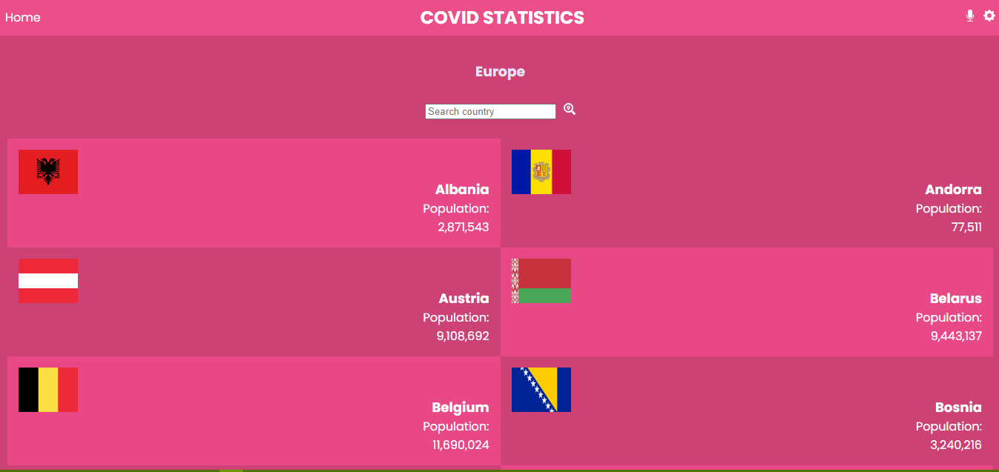
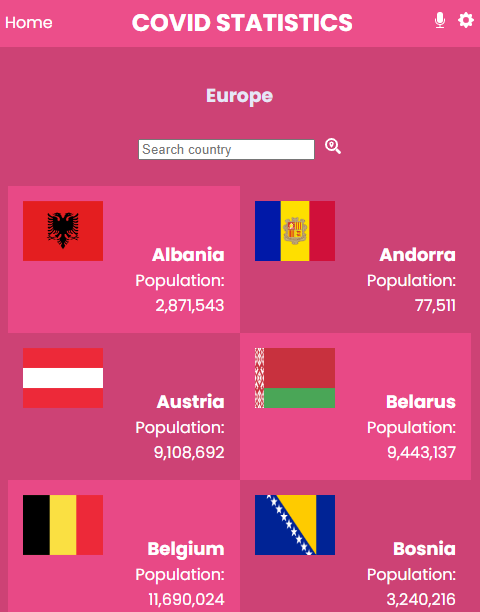

# COVID Statistics
This app use an external API of the COVID infection cases for different countries. With a search bar to filter using the total number of cases depending on the past date and also filter using the specific country input or search button. Built with react, redux and CSS.

### Built With
- React
- Redux
- JavaScript

## Live Demo Links
[View Demo](https://europe-covid-stats.netlify.app/)

### Getting Started
To get a local copy up and running follow these simple example steps.

Clone: https://github.com/HSMathebula/metrics-webapp.git

- Run npm install
- Run npm build
- Run npm run start
- Run npm run test

### Authors
👤 Happen S Mathebula

GitHub: [@HSMathebula](https://github.com/lembani)
Twitter: [@HappenSipho](https://twitter.com/lembani_)
LinkedIn: [happen-sipho-mathebula](www.linkedin.com/in/happen-sipho-mathebula)

## 🤝 Contributing

Contributions, issues, and feature requests are welcome!

Feel free to check the [issues page](../../issues/).

## Show your support

Give a ⭐️ if you like this project!

### Acknowledgments

- Original design idea by [Nelson Sakwa](https://www.behance.net/sakwadesignstudio) on [Behance](https://www.behance.net/gallery/31579789/Ballhead-App-(Free-PSDs)).

- Hat tip to anyone whose code was used

## 📝 License

This project is [MIT](./MIT.md) licensed.